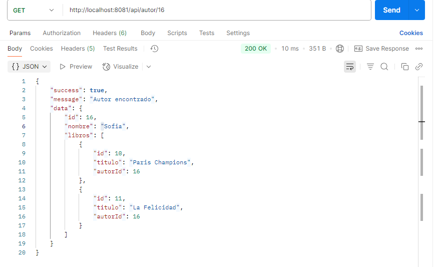

## API: Instalación y Ejecución de Pruebas

### 1. Clona el repositorio

```bash
git clone https://github.com/nicolasback04/proyecto-informa.git
cd proyecto-informa
```


---

### 2. Construcción y despliegue con Docker Compose

```bash
docker-compose up --build
```


---

### 3. Pruebas de la API con Postman

#### API: Autores

- **Guardar Autor**

  

- **Consultar Autor**

  

- **Consultar Autores con libros asociados**

  

- **Consultar Todos los Autores**

  

- **Actualizar Autor**

  

- **Eliminar Autor**

  

---

#### API: Libros

- **Registrar Libro**

  

- **Consultar libro por ID**

  

- **Consultar Todos los Libros**

  

- **Actualizar libro por ID**

  

- **Eliminar libro por ID**

  

---


> Las imágenes muestran respuestas exitosas obtenidas directamente desde la URL pública de la API.

> **Nota:** Todas las pruebas se realizaron sobre la instancia local corriendo en [http://localhost:8081/api/](http://localhost:8081/api/) o en la instancia en producción [https://app-biblio-production-ed53.up.railway.app/api/](https://app-biblio-production-ed53.up.railway.app/api/).
